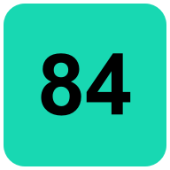
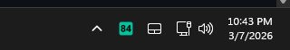
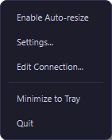
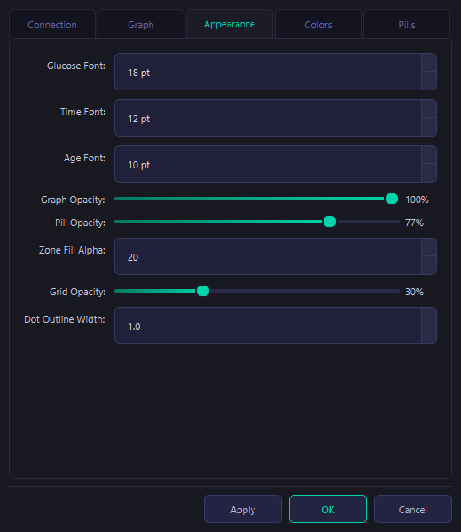
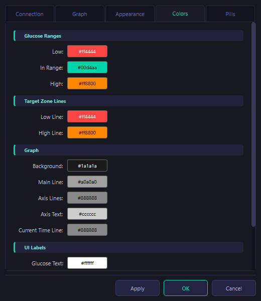
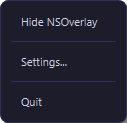

# NSOverlay

A lightweight always-on-top desktop widget for Windows that displays real-time glucose data from your [Nightscout](https://nightscout.github.io/) server.

## Features

- Real-time glucose reading with trend arrow
- Interactive graph with zoom, pan, and color-coded zones
- Adjustable transparency — from fully opaque to fully see-through
- Draggable, resizable, remembers position and zoom state
- Settings dialog for live customization (dot size, line width, opacity, font sizes, target range)
- Quick Nightscout entry for insulin and carbs from the widget or tray menu
- Right-click context menu with all options
- Insulin-on-board curve on the graph, driven by the treatment timestamp and insulin profile
- **System tray icon** — colour-coded icon shows the current glucose value at a glance; right-click for a quick menu, double-click to toggle the widget


<p align="center">
  
  &nbsp;&nbsp;
  
</p>

## Quick Start

### 1. Clone and install

```bash
git clone https://github.com/guilhermediasl/NSOverlay.git
cd nsoverlay
python -m venv .venv
.venv\Scripts\activate       # Windows
pip install -r requirements.txt
```

### 2. Run

```bash
python nsoverlay.py
```

On **first run**, a setup wizard will appear asking for your Nightscout URL and API secret. These are saved to `config.json` (which is gitignored — your credentials never leave your machine).


To change the connection later: **right-click → Edit Connection…**



## Configuration

`config.json` is created automatically by the setup wizard. You can also copy `config.json.example` and edit it manually:

```bash
cp config.json.example config.json
```

### Key settings

| Setting | Description | Default |
|---|---|---|
| `nightscout_url` | Your Nightscout site URL (include `https://`) | — |
| `api_secret` | Plain-text API secret (hashed automatically) | — |
| `refresh_interval_ms` | How often to pull new data (ms) | `10000` |
| `timezone_offset_hours` | Local UTC offset | `0` |
| `time_window_hours` | Hours of history shown in graph | `3` |
| `entries_to_fetch` | Number of glucose entries to request from the API | `90` |
| `target_low` / `target_high` | Your glucose target range (mg/dL) | `70` / `180` |
| `widget_width` / `widget_height` | Initial window size in pixels | `400` / `280` |
| `glucose_font_size` | Font size for the main glucose reading | `18` |
| `time_font_size` | Font size for the time label | `12` |
| `age_font_size` | Font size for the data-age label | `10` |
| `show_delta` | Show glucose delta vs 5 min ago | `true` |
| `adaptive_dot_size` | Scale dot size based on current zoom level | `false` |
| `data_point_size` | Dot size for glucose data points | `6` |
| `show_treatments` | Plot bolus / carb / exercise markers on the graph | `true` |
| `treatments_to_fetch` | Number of treatments to request from the API | `50` |
| `default_insulin_type` | Default insulin type used in the log-treatment dialog and IOB fallback | `"Humalog Lispro"` |
| `iob_dia_hours` | Per-user insulin duration of action used for IOB math | `5.0` |
| `iob_peak_minutes` | Per-user insulin peak time used for IOB math | `75` |
| `iob_onset_minutes` | Per-user insulin onset delay used for IOB math | `15` |
| `insulinType` on treatments | Stored with new insulin entries so the IOB curve can use the selected insulin profile | Humalog Lispro |
| `gradient_interpolation` | Colour-gradient from yellow→red as glucose moves away from range | `true` |
| `appearance.graph_background_opacity` | Graph background opacity 0–100 | `100` |
| `appearance.label_pill_opacity` | Header label pill opacity 0–100 | `40` |
| `appearance.graph_line_width` | Width of the glucose line in pixels | `2` |
| `appearance.graph_line_style` | Line style: `solid`, `dash`, `dot`, `dashdot` | `"solid"` |
| `appearance.show_y_label` | Show or hide the "Glucose" label on the Y axis | `true` |
| `appearance.marker_outline_width` | Width of the dot outline | `1.5` |
| `appearance.marker_outline_color` | Colour of the dot outline | `"#000000"` |
| `appearance.target_zone_opacity` | Opacity (0–255) of the low/high background zones | `20` |
| `appearance.grid_opacity` | Opacity (0–1) of the graph grid lines | `0.3` |
| `appearance.background_color` | Graph background colour | `"#1a1a1a"` |

All appearance settings can also be changed live via **right-click → Settings…**

### Header pills

Pills are small labels shown in the top-left corner of the widget, each summarising a Nightscout treatment type. Configured via the `header_pills` array:

```json
"header_pills": [
    {
        "event_type": "Basal Injection",
        "label": "Basal",
        "show_field": "notes",
        "suffix": "U",
        "sum_daily": true
    }
]
```

| Field | Description | Default |
|---|---|---|
| `event_type` | Nightscout `eventType` to match (case-insensitive) | **required** |
| `label` | Text shown inside the pill | value of `event_type` |
| `show_field` | Treatment field to display (e.g. `notes`, `insulin`, `carbs`) | none |
| `suffix` | Text appended after the value (e.g. `U`, `g`) | `""` |
| `sum_daily` | When `true`, sums `show_field` across **all** matching treatments on the current local day | `false` |
| `max_age_hours` | *(used when `sum_daily` is `false`)* Only show if most-recent match is within N hours | `24` |

Pills use a pastel cyan font (`#80e8e0`) with the same dark semi-transparent pill background as the time/age labels. A pill is hidden automatically if there is no matching treatment found for the current day (or within `max_age_hours`). Multiple pills can be defined in the array.

### Treatment markers on the graph

When `show_treatments` is `true`, the following `eventType` values are plotted directly on the graph in addition to appearing as header pills if configured:

| Event type | Marker |
|---|---|
| Correction Bolus / Meal Bolus / Bolus | `▼<amount>U` in blue |
| Carb Correction / Carbs | `▲<amount>g` in orange |
| Exercise | coloured horizontal band with label |
| **Basal Injection** | `▼<amount>U` in pastel cyan |

### Insulin on board

NSOverlay also plots an IOB curve for fast insulin. The curve starts at the moment an insulin treatment is logged and decays according to the selected insulin profile. The first supported profile is **Humalog Lispro**.

When you log insulin from the dialog, you can choose the insulin type. New entries save that choice in the treatment payload as `insulinType`, and the graph uses it when building the IOB line. Older entries without a type default to Humalog Lispro for now.

IOB computation is now configurable with Nightscout-style per-user settings:

- `iob_dia_hours` controls duration of action.
- `iob_peak_minutes` controls peak activity timing.
- `iob_onset_minutes` controls onset delay before insulin starts decaying.
- `default_insulin_type` defines the default type in the treatment dialog and the fallback when a treatment has no `insulinType`.

Priority order used at runtime:

1. Insulin type on the treatment event (`insulinType`)
2. Active Nightscout profile values (from `profile.json`)
3. Local `config.json` values (fallback)

<p align="center">
  
  &nbsp;
  
</p>
<p align="center">
  
</p>

## Usage

| Action | How |
|---|---|
| Move widget | Drag anywhere |
| Resize | Drag any edge or corner |
| Minimize to tray | Hover top-right → click ✕, or right-click → Minimize to Tray |
| Show/hide widget | Double-click tray icon, or tray right-click → Show/Hide NSOverlay |
| Settings | Right-click widget or tray icon → Settings… |
| Change Nightscout URL/secret | Right-click → Edit Connection… |
| Log insulin/carbs | Right-click widget or tray icon → Log Insulin / Carbs… |
| Reset graph view | Double-click the graph |
| Zoom graph | Mouse wheel on graph |
| Pan graph | Click-drag on graph |
| Quit fully | Tray icon right-click → Quit, or right-click widget → Quit |



## Keyboard shortcuts

| Shortcut | Action |
|---|---|
| `Ctrl+G` | Toggle gradient interpolation |
| `Ctrl+R` | Reload config from file |
| `Escape` / `Q` | Minimize to tray |

## How the code works

NSOverlay is now organized as a modular codebase with one app entrypoint and focused packages under `src/`.

### Runtime flow

1. `nsoverlay.py` boots the app, loads styles, and resolves runtime paths.
2. Config is loaded through `src/core/config_loader.py` (validation + defaults + deep merge).
3. `GlucoseWidget` initializes UI, graph, tray icon, timers, and worker thread.
4. Background API reads run in `src/data/remote_fetch_thread.py`.
5. Main thread receives merged cache updates, computes render keys, and redraws only when needed.
6. Timestamps are parsed via `src/core/datetime_parser.py` with bounded caching.
7. Graph axis labels come from `src/graph/time_axis.py`.
8. Setup and settings UIs are provided by `src/ui/setup_wizard.py` and `src/ui/settings_dialog.py`.

### Module map

- `nsoverlay.py`: Main app orchestration, rendering logic, interactions, tray behavior.
- `src/core/config_loader.py`: Config file loading, validation, defaults, appearance deep-merge.
- `src/core/datetime_parser.py`: Nightscout datetime parsing with cache.
- `src/data/remote_fetch_thread.py`: Persistent QThread that fetches entries/treatments.
- `src/graph/time_axis.py`: 24-hour axis label formatter.
- `src/ui/setup_wizard.py`: First-run/edit-connection wizard.
- `src/ui/settings_dialog.py`: Full settings dialog (tabs, pills editor, color controls).

### Data and rendering model

- Fetches are asynchronous and caches are merged forward, preventing regressions in age/timeline.
- The widget keeps render keys for glucose, treatments, and pills to avoid expensive redraws.
- Visual state (window position and zoom) is persisted locally in JSON files.

## File structure

```
nsoverlay/
├── nsoverlay.py              # Main application entrypoint
├── nsoverlay.spec            # PyInstaller spec (release build)
├── nsoverlay_debug.spec      # PyInstaller spec (debug build)
├── build.ps1                 # Automated build script (handles MS Store Python fix)
├── capture_screenshots.py    # Regenerates README screenshots under docs/images
├── create_shortcut.ps1       # Creates a desktop shortcut for taskbar pinning
├── set_appid.ps1             # Sets AppUserModelID on existing shortcuts
├── nsoverlay_launcher.vbs    # Silent VBS launcher (no console window)
├── icon.ico                  # Application icon
├── python311.dll             # MS Store Python DLL fix (used by build.ps1)
├── config.json.example       # Template — copy to config.json
├── config.json               # Your config (gitignored)
├── requirements.txt          # Python dependencies
├── widget_position.json      # Auto-saved window position (gitignored)
├── zoom_state.json           # Auto-saved zoom state (gitignored)
├── src/
│   ├── core/
│   │   ├── config_loader.py
│   │   └── datetime_parser.py
│   ├── data/
│   │   └── remote_fetch_thread.py
│   ├── graph/
│   │   └── time_axis.py
│   └── ui/
│       ├── settings_dialog.py
│       └── setup_wizard.py
├── styles/
│   ├── dark.qss
│   └── context_menu.qss
├── docs/
│   └── images/
└── README.md
```

## Building a standalone .exe (Windows)

The easiest way is to use the included build script, which also handles the Microsoft Store Python DLL issue automatically:

```powershell
.\build.ps1
```

Or manually:

```bash
pip install pyinstaller
pyinstaller nsoverlay.spec
```

The executable will be in `dist/nsoverlay/`.

> **Microsoft Store Python note:** If you installed Python from the MS Store, copy `python311.dll` from the repo root into `dist/nsoverlay/_internal/` after building (the `build.ps1` script does this automatically).

## Pinning to the taskbar

If you pin the app to the taskbar by right-clicking the running window, Windows may pin `python.exe` instead of NSOverlay (wrong icon, won't reopen the app). To create a proper shortcut:

1. Right-click `create_shortcut.ps1` → **Run with PowerShell**
2. An `NSOverlay` shortcut will appear on your Desktop with the correct icon.
3. Right-click that shortcut → **Pin to taskbar**

The shortcut launches `pythonw.exe` (no console window) and carries the correct `AppUserModelID` so the taskbar button groups correctly while the app is running.

## Troubleshooting

**No data / connection error** — Check your URL and API secret via right-click → Edit Connection…

**Wrong position on startup** — Delete `widget_position.json`.

**Graph zoom stuck** — Delete `zoom_state.json`.

**App won't quit with the ✕ button** — By design, ✕ minimizes to the system tray. To fully exit, right-click the tray icon → **Quit**.

**Tray icon not visible** — Make sure your taskbar notification area isn't hiding the icon. Click the "^" arrow in the system tray to find it, then drag it to the visible area.

**Run in debug mode** — Use `nsoverlay_debug.spec` with PyInstaller or just run from the terminal to see console output.

## Disclaimer

This software is for informational purposes only and is **not** a substitute for professional medical advice. Always consult your healthcare provider before making diabetes management decisions.

---

## LibreLink Up Glucose Display

In addition to the Nightscout-based overlay, this repo includes a standalone Python application that retrieves glucose data **directly from the LibreLink Up API** and displays it as an interactive graph.

### Features

- Authenticates with LibreLink Up (email + password) — no Nightscout required
- Fetches `X` glucose entries from the `/llu/connections/{patientId}/graph` endpoint
- Renders a desktop graph with colour-coded zones and trend arrows
- Configurable **time window** (1, 2, or 3 hours)
- Auto-refreshes every 60 seconds (configurable)
- First-run setup wizard; settings accessible via right-click menu

### Quick start

```bash
# 1. Install dependencies (already in requirements.txt)
pip install PyQt6 pyqtgraph requests

# 2. Copy and edit the config template
cp llu_config.json.example llu_config.json
# → fill in your email, password, and region

# 3. Run
python llu_glucose_display.py
```

If `llu_config.json` does not exist (or has no credentials), a setup wizard appears on first run.

### Configuration — `llu_config.json`

Copy `llu_config.json.example` to `llu_config.json` (this file is gitignored) and edit it:

```json
{
    "email":             "you@example.com",
    "password":          "your_password",
    "region":            "eu",
    "patient_index":     0,
    "patient_id":        "",
    "entries_to_fetch":  36,
    "time_window_hours": 3,
    "target_low":        70,
    "target_high":       180,
    "refresh_interval_ms": 60000,
    "widget_width":      520,
    "widget_height":     320
}
```

| Setting | Description | Default |
|---|---|---|
| `email` | LibreLink Up / LibreView account e-mail | **required** |
| `password` | Account password | **required** |
| `region` | Region code — see table below | `"eu"` |
| `patient_index` | Zero-based index into the connections list (when multiple patients are linked) | `0` |
| `patient_id` | Explicit patient UUID — takes priority over `patient_index` if provided | `""` |
| `entries_to_fetch` | Maximum number of glucose entries to show (`X`) | `36` |
| `time_window_hours` | Only show entries within the last N hours (1, 2, or 3) | `3` |
| `target_low` / `target_high` | Glucose target range in mg/dL | `70` / `180` |
| `refresh_interval_ms` | Auto-refresh interval in milliseconds | `60000` |
| `widget_width` / `widget_height` | Initial window size in pixels | `520` / `320` |

#### Region codes

| Code | Server |
|---|---|
| `ae` | api-ae.libreview.io |
| `ap` | api-ap.libreview.io |
| `au` | api-au.libreview.io |
| `ca` | api-ca.libreview.io |
| `cn` | api-cn.myfreestyle.cn |
| `de` | api-de.libreview.io |
| `eu` | api-eu.libreview.io |
| `eu2` | api-eu2.libreview.io |
| `fr` | api-fr.libreview.io |
| `jp` | api-jp.libreview.io |
| `la` | api-la.libreview.io |
| `ru` | api.libreview.ru |
| `us` | api-us.libreview.io |

If you log in and receive a *"redirected to region X"* error, update the `region` field to match.

### Filtering logic

1. The client calls `GET /llu/connections/{patientId}/graph`, which returns a `graphData` array (historical readings) and `connection.glucoseMeasurement` (the live reading).
2. Both sources are merged; duplicate `FactoryTimestamp` values are deduplicated.
3. Only entries whose `FactoryTimestamp` (UTC) falls within the last `time_window_hours` hours are kept.
4. The remaining entries are sorted ascending and the most-recent `entries_to_fetch` are selected.

**So: the graph shows at most X entries, never older than the selected time window — whichever constraint is more restrictive wins.**

### Error handling

| Situation | Behaviour |
|---|---|
| Wrong credentials | `LibreLinkUpAuthError` → error label in the widget |
| Wrong region (redirect) | `LibreLinkUpAuthError` with region hint |
| Invalid region code | `LibreLinkUpRegionError` raised at startup |
| Empty data / no connections | Warning in the status label |
| Network / timeout | `requests.RequestException` → error label |
| Expired token | Automatic re-login on the next fetch cycle |

### Running the tests

```bash
python -m pytest tests/test_llu_client.py -v
```

The tests use `unittest.mock` and require no real credentials or network access.

### File structure (LibreLink Up additions)

```
nsoverlay/
├── llu_glucose_display.py        # Standalone LibreLink Up display app
├── llu_config.json.example       # Config template (copy to llu_config.json)
├── llu_config.json               # Your config (gitignored)
├── src/
│   └── data/
│       └── llu_client.py         # LibreLink Up API client
└── tests/
    └── test_llu_client.py        # Unit tests for the LLU client
```

---

## License

MIT
