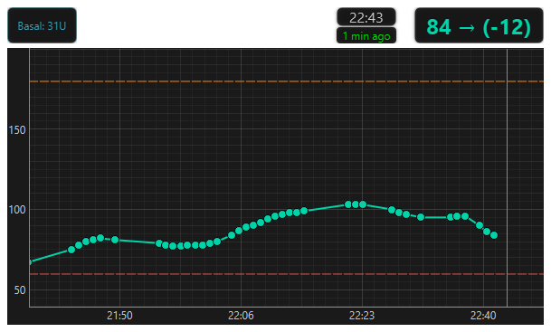
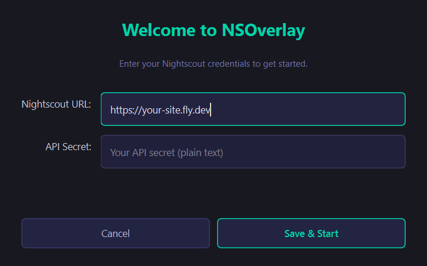
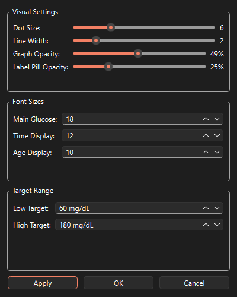

# NSOverlay

A lightweight always-on-top desktop widget for Windows that displays real-time glucose data from your [Nightscout](https://nightscout.github.io/) server.

## Features

- Real-time glucose reading with trend arrow
- Interactive graph with zoom, pan, and color-coded zones
- Adjustable transparency — from fully opaque to fully see-through
- Draggable, resizable, remembers position and zoom state
- Settings dialog for live customization (dot size, line width, opacity, font sizes, target range)
- Right-click context menu with all options



## Quick Start

### 1. Clone and install

```bash
git clone https://github.com/yourusername/nsoverlay.git
cd nsoverlay
python -m venv .venv
.venv\Scripts\activate       # Windows
pip install -r requirements.txt
```

### 2. Run

```bash
python nsoverlay.py
```

On **first run**, a setup wizard will appear asking for your Nightscout URL and API secret. These are saved to `config.json` (which is gitignored — your credentials never leave your machine).



To change the connection later: **right-click → Edit Connection…**

## Configuration

`config.json` is created automatically by the setup wizard. You can also copy `config.json.example` and edit it manually:

```bash
cp config.json.example config.json
```

### Key settings

| Setting | Description | Default |
|---|---|---|
| `nightscout_url` | Your Nightscout site URL (include `https://`) | — |
| `api_secret` | Plain-text API secret (hashed automatically) | — |
| `refresh_interval_ms` | How often to pull new data (ms) | `60000` |
| `timezone_offset_hours` | Local UTC offset | `0` |
| `time_window_hours` | Hours of history shown in graph | `3` |
| `entries_to_fetch` | Number of glucose entries to request from the API | `90` |
| `target_low` / `target_high` | Your glucose target range (mg/dL) | `70` / `180` |
| `widget_width` / `widget_height` | Initial window size in pixels | `400` / `280` |
| `glucose_font_size` | Font size for the main glucose reading | `18` |
| `time_font_size` | Font size for the time label | `12` |
| `age_font_size` | Font size for the data-age label | `10` |
| `show_delta` | Show glucose delta vs 5 min ago | `true` |
| `data_point_size` | Dot size for glucose data points | `6` |
| `show_treatments` | Plot bolus / carb / exercise markers on the graph | `true` |
| `treatments_to_fetch` | Number of treatments to request from the API | `50` |
| `gradient_interpolation` | Colour-gradient from yellow→red as glucose moves away from range | `false` |
| `appearance.graph_background_opacity` | Graph background opacity 0–100 | `100` |
| `appearance.label_pill_opacity` | Header label pill opacity 0–100 | `67` |
| `appearance.graph_line_width` | Width of the glucose line in pixels | `2` |
| `appearance.graph_line_style` | Line style: `solid`, `dash`, `dot`, `dashdot` | `"solid"` |
| `appearance.show_y_label` | Show or hide the "Glucose" label on the Y axis | `true` |
| `appearance.marker_outline_width` | Width of the dot outline | `1.5` |
| `appearance.marker_outline_color` | Colour of the dot outline | `"#000000"` |
| `appearance.target_zone_opacity` | Opacity (0–255) of the low/high background zones | `20` |
| `appearance.grid_opacity` | Opacity (0–1) of the graph grid lines | `0.3` |
| `appearance.background_color` | Graph background colour | `"#1a1a1a"` |

All appearance settings can also be changed live via **right-click → Settings…**

### Header pills

Pills are small labels shown in the top-left corner of the widget, each summarising a Nightscout treatment type. Configured via the `header_pills` array:

```json
"header_pills": [
    {
        "event_type": "Basal Injection",
        "label": "Basal",
        "show_field": "notes",
        "suffix": "U",
        "sum_daily": true
    }
]
```

| Field | Description | Default |
|---|---|---|
| `event_type` | Nightscout `eventType` to match (case-insensitive) | **required** |
| `label` | Text shown inside the pill | value of `event_type` |
| `show_field` | Treatment field to display (e.g. `notes`, `insulin`, `carbs`) | none |
| `suffix` | Text appended after the value (e.g. `U`, `g`) | `""` |
| `sum_daily` | When `true`, sums `show_field` across **all** matching treatments on the current local day | `false` |
| `max_age_hours` | *(used when `sum_daily` is `false`)* Only show if most-recent match is within N hours | `24` |

Pills use a pastel cyan font (`#80e8e0`) with the same dark semi-transparent pill background as the time/age labels. A pill is hidden automatically if there is no matching treatment found for the current day (or within `max_age_hours`). Multiple pills can be defined in the array.

### Treatment markers on the graph

When `show_treatments` is `true`, the following `eventType` values are plotted directly on the graph in addition to appearing as header pills if configured:

| Event type | Marker |
|---|---|
| Correction Bolus / Meal Bolus / Bolus | `▼<amount>U` in blue |
| Carb Correction / Carbs | `▲<amount>g` in orange |
| Exercise | coloured horizontal band with label |
| **Basal Injection** | `▼<amount>U` in pastel cyan |



## Usage

| Action | How |
|---|---|
| Move widget | Drag anywhere |
| Resize | Drag any edge or corner |
| Close | Hover top-right → click ✕ |
| Settings | Right-click → Settings… |
| Change Nightscout URL/secret | Right-click → Edit Connection… |
| Reset graph view | Double-click the graph |
| Zoom graph | Mouse wheel on graph |
| Pan graph | Click-drag on graph |

## Keyboard shortcuts

| Shortcut | Action |
|---|---|
| `Ctrl+G` | Toggle gradient interpolation |
| `Ctrl+R` | Reload config from file |
| `Escape` / `Q` | Close |

## File structure

```
nsoverlay/
├── nsoverlay.py              # Main application
├── nsoverlay.spec            # PyInstaller spec (release build)
├── nsoverlay_debug.spec      # PyInstaller spec (debug build)
├── build.ps1                 # Automated build script (handles MS Store Python fix)
├── create_shortcut.ps1       # Creates a desktop shortcut for taskbar pinning
├── set_appid.ps1             # Sets AppUserModelID on existing shortcuts
├── nsoverlay_launcher.vbs    # Silent VBS launcher (no console window)
├── icon.ico                  # Application icon
├── python311.dll             # MS Store Python DLL fix (used by build.ps1)
├── config.json.example       # Template — copy to config.json
├── config.json               # Your config (gitignored)
├── requirements.txt          # Python dependencies
├── widget_position.json      # Auto-saved window position (gitignored)
├── zoom_state.json           # Auto-saved zoom state (gitignored)
└── README.md
```

## Building a standalone .exe (Windows)

The easiest way is to use the included build script, which also handles the Microsoft Store Python DLL issue automatically:

```powershell
.\build.ps1
```

Or manually:

```bash
pip install pyinstaller
pyinstaller nsoverlay.spec
```

The executable will be in `dist/nsoverlay/`.

> **Microsoft Store Python note:** If you installed Python from the MS Store, copy `python311.dll` from the repo root into `dist/nsoverlay/_internal/` after building (the `build.ps1` script does this automatically).

## Pinning to the taskbar

If you pin the app to the taskbar by right-clicking the running window, Windows may pin `python.exe` instead of NSOverlay (wrong icon, won't reopen the app). To create a proper shortcut:

1. Right-click `create_shortcut.ps1` → **Run with PowerShell**
2. An `NSOverlay` shortcut will appear on your Desktop with the correct icon.
3. Right-click that shortcut → **Pin to taskbar**

The shortcut launches `pythonw.exe` (no console window) and carries the correct `AppUserModelID` so the taskbar button groups correctly while the app is running.

## Troubleshooting

**No data / connection error** — Check your URL and API secret via right-click → Edit Connection…

**Wrong position on startup** — Delete `widget_position.json`.

**Graph zoom stuck** — Delete `zoom_state.json`.

**Run in debug mode** — Use `nsoverlay_debug.spec` with PyInstaller or just run from the terminal to see console output.

## Disclaimer

This software is for informational purposes only and is **not** a substitute for professional medical advice. Always consult your healthcare provider before making diabetes management decisions.

## License

MIT
